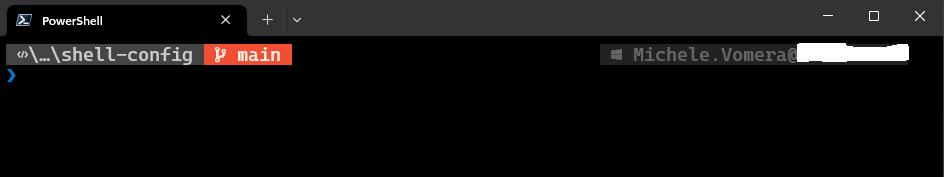
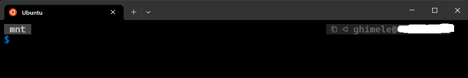

# 🔥 My Shell Config

## About
This is my shell configuration using **oh-my-posh**.

I've created my own theme based on [Tiwahu](https://ohmyposh.dev/docs/themes#tiwahu) theme that is supplied with Oh-My-Posh

## Installation
Follow the installation instructions from [Oh-My-Posh](https://github.com/JanDeDobbeleer/oh-my-posh) to install Oh-My-Posh

- For Bash shell I've created a simple script [oh-my-posh-install.sh](scripts/oh-my-posh-install.sh)

- For PowerShell do the following steps:
  - [oh-my-posh-install.bat](scripts/oh-my-posh-install.bat) to install PowehShell 7 and Oh My Posh
  - open the PoweShell prompt as Administrator and run [oh-my-posh-config.ps1](scripts/oh-my-posh-config.ps1)

## Prerequisites

⚠ **You should use a modern console** host like the official Windows Terminal to have a great terminal experience on Windows. ⚠

## Techologies used

- [oh-my-posh](https://github.com/JanDeDobbeleer/oh-my-posh)
- [PowerShell](https://learn.microsoft.com/en-us/powershell/scripting/install/installing-powershell-on-windows?view=powershell-7.3)
- [Windows Teminal](https://learn.microsoft.com/en-us/windows/terminal/install#install)